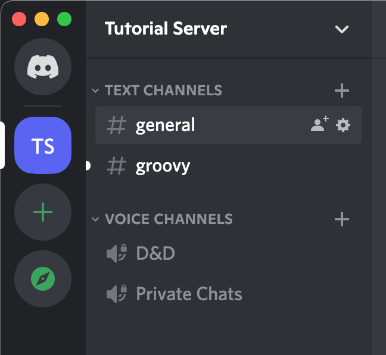
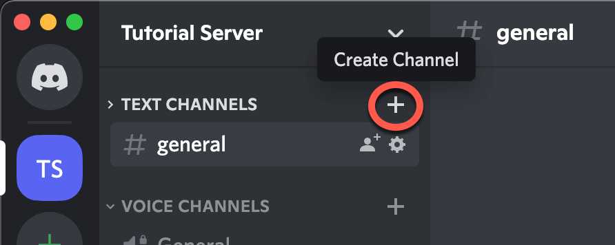
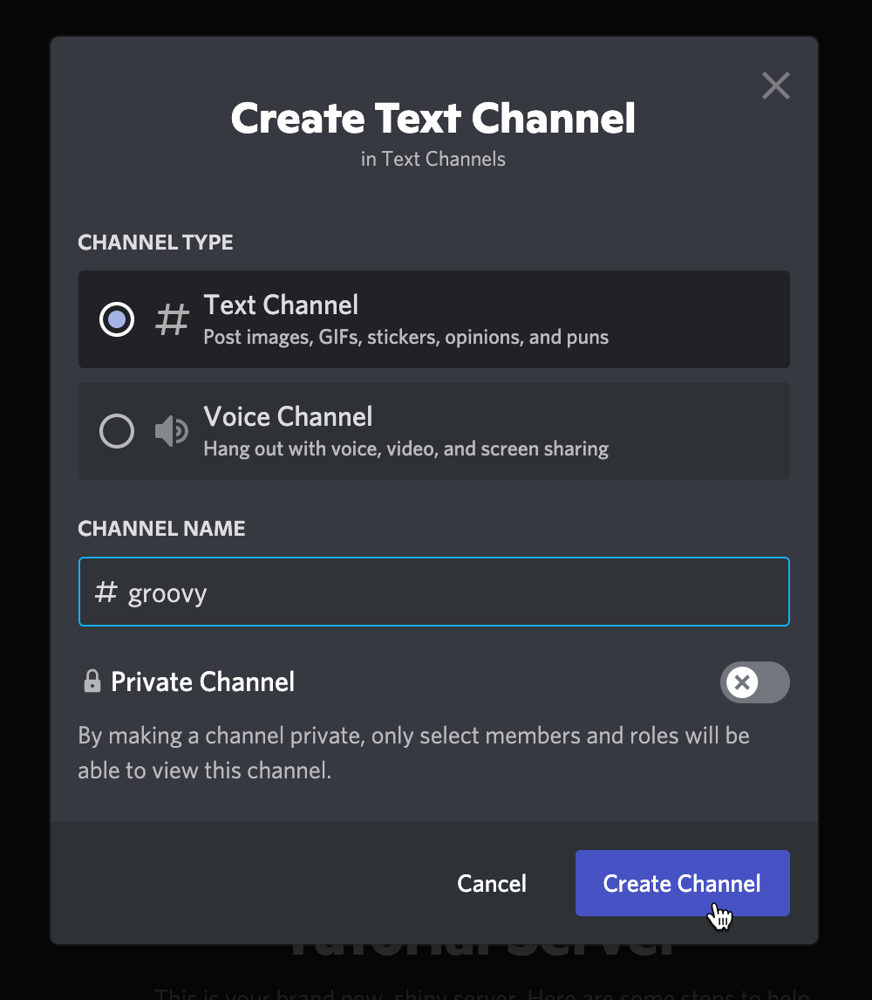
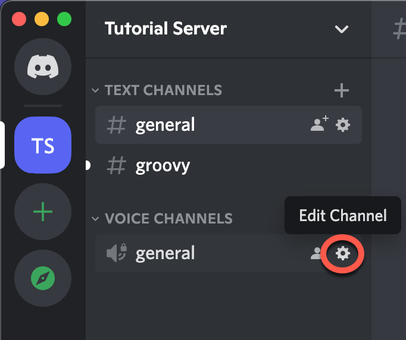
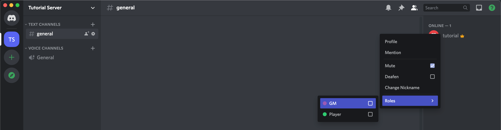
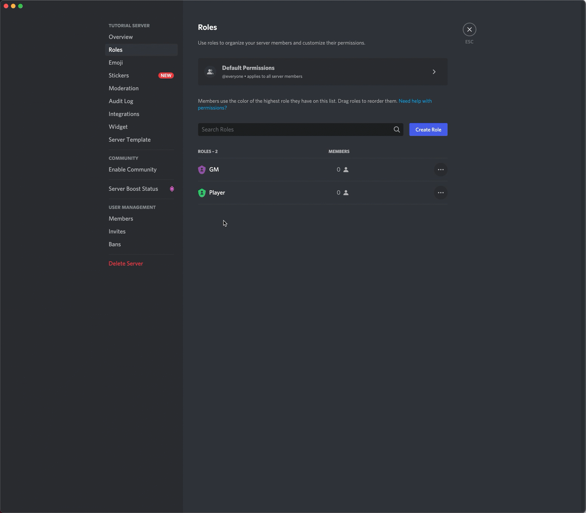
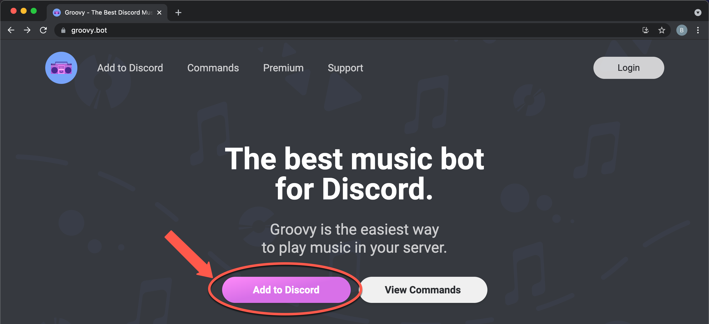
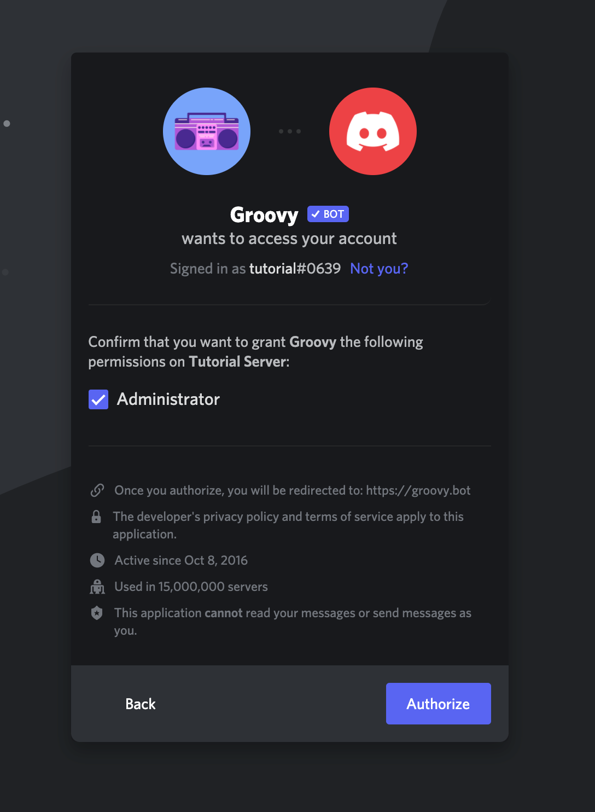
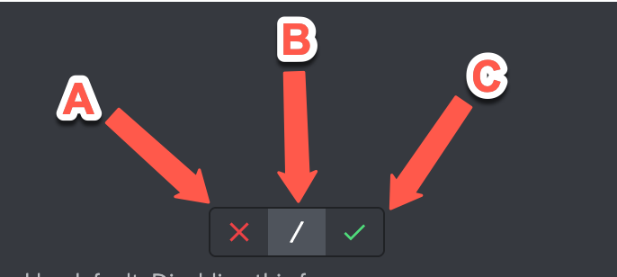

# Discord Setup for Dungeons & Dragons

## Contents
- [Introduction](#introduction)
- [Prerequisites](#prerequisites)
- [1. Create Your Server](#serverCreation)
- [2. Create Your Channels](#createChannelsSection)
  - [2.1. Creating Channels](#createChannels)
  - [2.2. Renaming Channels](#renameChannels)
- [3. Create User Roles and Configure Permissions](#createRoles)
- [4. Get Your Music Bot](#inviteGroovy)
- [5. Keep Going!](#nextSteps)

## Introduction 

If you're a game master (GM) and you're running tableop roleplaying games (TTRPGs) virtually, you need a Discord server.
Discord is the most popular tool in the TTRPG space for hosting a gaming community, or even a fanbase. Though some of its
essential features can be found on virtual tabletops (VTTs), such as Roll20, both Discord's UI and the quality of its services
are superior to what is offered by available VTTs. It's also much more convenient for your community to interact through Discord
than through a VTT, or through other chat-focused apps like Zoom or Teams.

Discord servers are free spaces that provide text, voice, and video chat features. This guide will help you quickly create a well organized, ready to scale, and invite-only server with a music bot that you can use to add atmosphere to your games. By the end, you'll also be familiar with all of the essential features of the app.

**Note:** This is a tutorial. It does not discuss the features of Discord in depth. However, it does touch on a few gotchas so you won't be caught off guard in the middle of a game.

First, we'll create your server. Second, we'll create a new text channel specifically for communicating with your music bot and a new voice channel for private chats with players. Then, we'll create some user roles for GMs and Players. Once we have those, we'll configure server-wide and channel-specific permissions for those roles. That will give your server some structure. In the last section, you'll find a recommendation for a dice rolling bot!

This will take about 25 minutes. Let's get going!

## Prerequisites 
You need to have the Discord app installed, and you need to have an account. For assistance with either of these steps, consult Discord's guide to [Getting Started](https://support.discord.com/hc/en-us/articles/360033931551-Getting-Started). That process will only take a few minutes.

System requirements can be found [here](https://support.discord.com/hc/en-us/articles/213491697-What-are-the-OS-system-requirements-for-Discord-). (You'll need about 65 MB of available hard drive space.)

If you're configuring a server that you don't own, you'll need the *Manage Server* permission on that server. Otherwise, no experience with Discord beyond installation and account creation is necessary.

## 1. Create Your Server 
Time to create your server! This is where you will be hosting your games. It'll be a bit lonely at first, but soon it will be full of friends! 

**Follow these steps** to create your server:
<ol>
  <li>
    Click on the <em>Add a Server</em> button, represented by a plus icon on left-side menu bar.
  </li>
  <li>
    Select <em>Create My Own.</em>
  </li>
  <li>
    Select <em>For me and my friends.</em>
    <ul>
      <li>
        Don't worry about server templates for now. They won't help with what we're doing.
      </li>
    </ul>
  </li>
  <li>
    Give your server a name, and click <em>Create.</em>
  </li>
</ol>

**Fig. 1.1** shows what that process looks like.

  
   
  <b>Fig. 1.1 - Server Creation</b>

## 2. Create Your Channels 
Now, let's create two new channels for your server. You'll want a dedicated text channel to communicate with your music bot. You'll also want a second voice channel (these also have video chat capalities) so you can pull players aside for private chats during games.

<b>Fig. 2</b> shows what you'll see when you're done!

  
   
  <b>Fig. 2.1 - New Channels Example</b>

### 2.1. Creating Channels 
**Follow these steps** to create your new channels:
<ol>
  <li>
    To the right of <em>TEXT CHANNELS</em>, click on the plus icon - see <b>Fig. 2.1.1</b>.
  </li>
  <li>
    When you see the <em>Create Text Channel</em> popup, enter a name for your server, then click <em>Create Channel</em> - see <b>Fig. 2.1.2</b>.
    <ul>
      <li>
        Ensure that <em>Private Channel</em> is <b>unchecked</b>.
      </li>
    </ul>
  </li>
  <li>
    Repeat this process to create a new voice channel for private chats with players during games.
  </li>
</ol>

      
       
      <b>Fig. 2.1.1 - Create Channel Button</b>

      
       
      <b>Fig. 2.1.2 - Create Channel Popup</b>

    

### 2.2. Renaming Channels 
Because this is a gaming server, let's rename the <em>general</em> voice channel to better fit that theme.

**Follow these steps** to rename a channel:
<ol>
  <li>
    Click on the gear icon to the right of the channel name, which will take you to the channel's settings page - see <b>Fig. 2.2.1</b>.
  </li>
  <li>
    Change the server's name.
  </li>
  <li>
    Click on the green <em>Save Changes</em> button, which will appear at the bottom of the page.
  </li>
</ol>

  
   
  <b>Fig. 2.2.1 - Edit Channel Button</b>

## 3. Create User Roles and Configure Permissions 
Let's create a role for GMs, and one for players. Then, we'll configure permissions for those roles.

Permissions define what users are allowed to do in your server and its channels. There are server-wide permissions
and channel-specific permissions. Channel-specific permissions will override server permissions. Users get their permissions
from the roles they are assigned. A user might have multiple roles with conflicting permissions, but you won't have an
issue with that for now.

Note: a more detailed discussion of permissions can be found [here](https://support.discord.com/hc/en-us/articles/206141927-How-is-the-permission-hierarchy-structured-)

As you begin scaling your community and adding features to your server, you will need more complex roles and permissions. But that's not what this guide is about. 

### 3.1. Roles

Roles are essential to maintaining a well-organized and stable server.

#### 3.1.1. Creating Roles
Let's create the "GM" role first. Then, repeat the steps below to create a "Player" role.

**Follow these steps** to create your new roles:
<ol>
  <li>
    
  </li>
  <li>
    
  </li>
</ol>

**Fig.** shows what that process looks like.

  
   
  <b>Fig. 3.1.1.1 - Role Creation</b>

#### 3.1.2 Assigning Roles
Now, assign the "GM" role to yourself.

Just right click on a user's name and navigate to the roles options. Dont worry about assigning roles to yourself. As the owner, you have permanent admin privileges which cannot be taken away from you.

**Follow these steps** to assign your new roles:
<ol>
  <li>
    
  </li>
  <li>
    
  </li>
</ol>

**Fig.** shows what that process looks like.

  
   
  <b>Fig. 3.1.2.1 - Assign Roles</b>

### 3.2. Server Permissions

We won't go into detail, explaining what each permission does. Basically, players need the ability to navigate through and speak in your social channels. And GMs need the ability to speak over people, mute people, move players around, and even kick or ban players that are causing problems. Just make sure that you configure your GM and Player permissions to look like [this](https://github.com/brohlf/technical-writing-portfolio/blob/main/Discord%20Setup%20Tutorial/Permission%20Configurations/gm-player-configs.md).

**Follow these steps** to navigate to the permissions for a particular role:
<ol>
  <li>
    
  </li>
  <li>
    
  </li>
</ol>

**Fig.** shows what that process looks like.

  
   
  <b>Fig. 3.2.1 - Navigate Permissions</b>

## 4. Get Your Music Bot 

Groovy bot is one the most popular music bots for Discord. Music support from VTTs is unreliable, so if you want music in your game, you should have a music bot as backup. We will confine Groovy to a single channel so that it won't clutter your chat. You also don't want just anyone controlling it. DMs should have exclusive control over
the music in their games. So we'll make sure of that too.

### 4.1. Invite Groovy Bot

**Follow these steps** to navigate to invite Groovy to your server:
<ol>
  <li>
    
  </li>
  <li>
    
  </li>
</ol>

Click the following link to download [Groovy Bot](https://groovy.bot/). Click "Add to Discord" to begin the invititation process.

  
   
  <b>Fig. 4.1.1 - Add To Discord Button</b>

This will navigate you to a panel that contains a dropdown menu titled "ADD TO SERVER." Select your server name and click continue. You may also need to login.

At this point, you should see this panel. You need to grant admin privileges so that Groovy can create a role for itself. But, once it's done that, you should revoke admin privileges. Click "Authorize."

  
   
  <b>Fig. 4.1.2 - Grant Admin Privilages</b>

Now, you should see a new member in your chat! This is groovy bot. 

### 4.2 Configuring Groovy Bot

But it doesn't need those admin privileges anymore. Navigate to your list of server roles in server settings. You should see a new role for Groovy. Navigate to the permissions tabs for the "Groovy" role and configure its permissions to match the [following](https://github.com/brohlf/technical-writing-portfolio/blob/main/Discord%20Setup%20Tutorial/Permission%20Configurations/groovy-configs.md).

Now let's restrict Groovy from seeing anything that happens in the "general" text channel. Navigate to the channel settings by clicking on the gear icon to the right of the channel name. We'll modify Groovy's permissions for this specific channel. You'll have to add the groovy role to the list of roles tracked by this channel. At first, you should only see the "@Everyone" role.

**Follow these steps** to navigate to invite Groovy to your server:
<ol>
  <li>
    
  </li>
  <li>
    
  </li>
</ol>

**Fig.** shows what that process looks like.

  
   
  <b>Fig. 4.2.1 - Navigate Channel Permissions</b>

Channel permissions override server permissions. And they take effect only in the server for which they are configured.
You will see a list of permissions each with an x, a slash, and a check next to them. Here's what they mean:
- a: explicitly deny this permission for this server
- b: inherit server permission
- c: explicitly allow this permission for this server

  
   
  <b>Fig. 4.2.2 - Channel Permission Explanation</b>

Explicitly deny all permissions to Groovy in the general channel.

Explictly give players permission to view the channel and to read text history in the Groovy channel.

### 4.3 Using Groovy Bot

**Follow these steps** get familiar with Groovy's basic commands:
<ol>
  <li>
    
  </li>
  <li>
    
  </li>
</ol>

[Groovy Commands](https://groovy.bot/commands)

when you pause groovy, you need to explicitly unpause it. Using the play command again won't work.
you'r most frequently used commands will be /play, /pause, /unpause, and /clear

## 5. Keep Going! 
Groovy isn't the only helpful bot! If you aren't using a VTT, but you need a way to roll dice, you can do that right in your server! Invite the "Avrae" bot and create another channel for dice rolling.

As cool as Groovy is, you will eventually want to get some of your real friends into the server. If you need some help with that, follow this short guide to inviting your friends: [inviting friends](https://support.discord.com/hc/en-us/articles/204155938-How-do-I-invite-friends-to-my-server-)

As your community grows, you will need to add more roles, more bots to moderate your users, and more channels.
